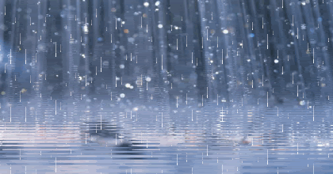

# YiweiLi_yili0186_9103individualtask

### Individual Task Inspiration

** I used ‘Time-based: animation using timers and events...’ based on the group source code, to add a flow effect to the waves and rainfall. **

### Change Description for waves

** Animation looping: added > noLoop() to settings and > loop() to draw to ensure a continuous animation effect.
   Time-based animation: added > frameCount to > drawWave to create animation effects.
   Frame rate: set > frameRate(30) to control the animation speed.
   Background refresh: use > background(222,184,93) at the beginning of the draw function to clear the canvas at each frame to prevent traces of previous frames from appearing and matching the animation. **

** The drawWave function will now draw the wave animation over time, resulting in a dynamic effect. The sky and its reflection remain as a static gradient, while the waves move with each frame, simulating a natural wave effect. **

[Introduction to motion graphics in P5.js - Learn by Digital Harbor Foundation. (2020, March 10). Learn by Digital Harbor Foundation.] (http://learn.digitalharbor.org/courses/creative-programming/lessons/introduction-to-motion-graphics-in-p5-js/)

### Change Description for Rainfalls

** Similarly, I added a rain animation effect to the group's original canvas.
   Construction function: set the position, length, speed and weight of the raindrops.
   Update method: Updates the position of the raindrop. If the raindrop leaves the bottom of the canvas, it is reset to the top.
   Show method: draws the raindrop.
   > drawRain function: loops over the > raindrops array, calls > update and > show methods on each raindrop to animate the falling raindrops.
   Setup function: initialise the > Raindrops object array. **

** This will animate the raindrops and waves to make the scene more animated and visually attractive. **

[Arrays in P5.js. (2020, July 18). Happy Coding.]  (https://happycoding.io/tutorials/p5js/arrays)
[Animation in P5.js. (2020, May 30). Happy Coding.]  (https://happycoding.io/tutorials/p5js/animation)

### Comment Explained

1. Raindrop class:
** Set raindrops with random position, length, weight and set faster speed.
   Make the raindrop move towards the bottom of the canvas and reset its position when it leaves the bottom.
   Draw raindrops as lines. **

2. drawWave function:
** Sets the number of wave layers, starting Y position and height of each layer.
   Calculates the position and loops through each wave layer. **

### Uniqueness

** Unique to the other team members, I animated the canvas to be more realistic, as well as the rain effect. The other two team members used Audio and Perlin noise to change the colours of the canvas, added other elements and even made the waves move according to the frequency of the sound, which were very creative ideas. **

#### Tips
- > This is a blockquote.
- [] () This is link to reference.
- ! [] () This is link to image or gif.
- The original code comments in sketch.js were removed from my single session because the code was too long with the comments; the other changes were based on  the animations I wanted to create.